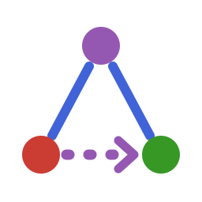

# Revel.jl


[](https://github.com/statistical-network-analysis-with-Julia/Revel.jl)
[](https://github.com/statistical-network-analysis-with-Julia/Revel.jl/actions/workflows/CI.yml?query=branch%3Amain)
[](https://statistical-network-analysis-with-Julia.github.io/Revel.jl/dev/)
[](https://julialang.org/)
[](https://opensource.org/licenses/MIT)

<p align="center">
  
</p>

Relational event effects, interactions and diagnostics for Julia.

## Overview

Revel.jl builds on [Relevent.jl](https://github.com/statistical-network-analysis-with-Julia/Relevent.jl)
and [REM.jl](https://github.com/statistical-network-analysis-with-Julia/REM.jl).
It adds the network effects, covariate effects, effect × covariate interactions
and goodness-of-fit diagnostics mapped by a scoping review of the relational
event model literature (2008–2026; unpublished, summarised in
`docs/src/guide/literature.md`), and organises them the way that review found
the literature to be organised:

- four **structural configurations** — the dyad (in either direction), node
  degree, the two-path, the three-path — as five parametric statistics;
- a small number of **measurement choices** — the memory kernel, which events
  count, event weights, scaling, the zero-history value — that are orthogonal
  to the configuration and explain why "the same" effect has a different value
  in every package;
- the literature's **names** as constructors on top, with a concordance to
  relevent, remstats, rem, goldfish and eventnet.

Revel.jl hosts no optimizer and no likelihood of its own. Its statistics are
methods of the ecosystem's shared `compute` generic, so they work in
`Relevent.fit_obpm` and `fit_timing` (full risk set), in `REM.fit_rem`, and in
Revel's own `fit_revel`, which routes a model to whichever of those owns its
likelihood.

## Installation

Requires Julia 1.12+. This unreleased development version uses sibling source
paths. Clone its dependencies beside it, then instantiate the package:

```bash
git clone https://github.com/statistical-network-analysis-with-Julia/Networks.jl
git clone https://github.com/statistical-network-analysis-with-Julia/REM.jl
git clone https://github.com/statistical-network-analysis-with-Julia/Relevent.jl
git clone https://github.com/statistical-network-analysis-with-Julia/Revel.jl
cd Revel.jl
julia --project -e 'using Pkg; Pkg.instantiate()'
```

## Quick Start

```julia
using Networks, Revel

wtc = load_dataset(:wtc_police_calls)       # 481 radio calls among 37 officers
calls = [Event(row[2], row[3], Float64(row[1])) for row in eachrow(wtc.events)]
coordinator = SumEffect(Float64.(wtc.is_icr); name="coordinator")

stats = [coordinator, Inertia(transform=:log1p), Reciprocation(transform=:log1p)]
fit = fit_revel(calls, stats, wtc.n_actors)          # exact, full risk set
coeftable(fit)

# Which effect is missing? A score test screens candidates without refitting.
score_test(fit, [PShift(:AB_BA), RecencyRank(:send), OTP(transform=:log1p)])

better = fit_revel(calls, [stats; PShift(:AB_BA); RecencyRank(:send)], wtc.n_actors)
prediction_summary(better).recall                    # top-1, top-5, top-10 recall
```

## Features

- **Memory kernels** (`memory=`): `FullMemory`, `HalfLife` (either
  normalisation), `Window`, `IntervalMemory`, `PowerLaw`, `LinearDecay`,
  `KernelMemory`; age in clock units or in events (`clock=:order`);
  `profile_memory` and `interval_partition` to estimate the memory instead of
  assuming it.
- **Event layers**: event-type splits (`types=`), attribute filters (`keep=`),
  event weights (`weighted=`), undirected layers (`symmetric=`), shared between
  effects.
- **Endogenous effects**: `Inertia`, `Reciprocation`, `DyadActivity`; six
  sender/receiver degree effects with event or distinct-partner measure and
  `prop` scaling, and event volume, distinct partners or events per partner;
  `TotaldegreeDyad`, `DegreeMin`, `DegreeMax`, `DegreeDiff`,
  `DegreeAssortativity`; `OTP`, `ITP`, `OSP`, `ISP`, `SharedPartners` with six
  ways of combining the legs, a time order, and cross-layer legs;
  `BalanceEffect`; `FourCycleEffect`; `RecencyRank`, `TimeSince`; `PShiftABAB`,
  `UndirectedPShift`; `NodeTransitivity`, `StructuralSimilarity`.
- **Covariates**: static, categorical and time-varying actor covariates
  (`SendEffect`, `ReceiveEffect`, `MatchEffect`, `DiffEffect`,
  `SimEffect`, `AverageEffect`, `MinimumEffect`, `MaximumEffect`,
  `SumEffect`, `ProductEffect`), dyadic covariates (`TieEffect`), global
  covariates (`GlobalEffect`).
- **Interactions**, each construction under its own name: product terms
  (`Interaction`, with `Transformed` for centring and `Standardized` for
  scaling), filtered statistics (`MatchedDegree`, `matching_third`, `keep=`),
  type splits (`split_by_type`), attribute-weighted statistics
  (`TertiusEffect`, including the diversity of categories), stratified fits
  (`fit_stratified`, with Wald tests of stratum differences in
  `compare_coefficients`), time-varying coefficients (`fit_moving_window`).
- **Fitting**: `fit_revel` (alias `revel`) — ordinal or interval-timing; full,
  active, two-mode, custom or time-varying risk sets; undirected events;
  receiver choice (`fit_receiver_choice`); a subset of events as cases; sampled
  controls, whose cost is the rows drawn, not the risk set; Breslow and Efron
  tie corrections; `event_design` and `each_risk_set` for the design itself;
  `simulate_events`. Storage grows with the dyads that have a history, and one
  specification can be fitted from several tasks at once.
- **Goodness of fit**: `event_diagnostics` and `prediction_summary` (ranks,
  recall, deviance residuals, in or out of sample); `score_process_test`
  (cumulative score processes with Lin–Wei–Ying resampling, and a global test
  of their maximum); `score_test` (Rao score tests for omitted effects, without
  refitting); `gof` (simulation of auxiliary statistics with a joint
  Mahalanobis test, in the shared `Networks.GOFResult`); `mechanism_shares` and
  `closing_times`; `statistic_collinearity`, before fitting or at the estimate.
- **Relational hyperevents**: multi-actor events (`HyperEvent`), subset
  repetition, closure and attribute statistics, sampled non-events and
  `fit_rhem` — see the [guide](docs/src/guide/hyperevents.md).
- **Concordance**: `effect_catalogue()` maps every effect onto its name in
  relevent, remstats, rem, goldfish and eventnet.

## Validation

- **remstats 4.1.0**: a golden fixture of 141 statistic arrays (directed and
  undirected events; full, window, interval and decay memory; `prop` and `std`
  scaling; event weights; `consider_type = "separate"`; `a:b` products;
  `event()`) generated by `test/fixtures/r/revel_remstats.R`.
- **relevent 1.2.1**, through Relevent.jl: the cumulative statistics equal
  Relevent.jl's relevent-validated ones exactly, in both compute interfaces.
  (relevent's `FrPSndSnd`, `FrRecSnd` and `OSPSnd` are reproduced as relevent
  documents them; relevent 1.2.1's output differs from that documentation.)
- The two ordinal estimators, and `REM.fit_rem` on the full risk set, agree to
  optimizer tolerance, and a brute-force evaluation of the log partial
  likelihood matches both; simulate-and-recover tests cover the ordinal,
  timing, receiver-choice, two-mode and moderated models.
- The diagnostics are calibrated by simulation in the test suite: the score
  process test, the score test and the joint `gof` test hold their size on data
  simulated from the fitted model, and reject the model that omits an effect.
- Every memory kernel is checked against a brute-force evaluation of its
  definition, and every statistic against a hand-computed value; the
  documentation's code, and every value its comments state, run in the test
  suite.

The rem, goldfish and eventnet columns of the concordance follow those
packages' documentation and have **not** been checked numerically.

## Deliberate differences from remstats

Pinned by the golden fixture (see `docs/src/guide/concordance.md`):

- Under `memory = "decay"` remstats evaluates the decay at the time of the
  *previous* event; Revel evaluates it at the time of the event being explained,
  as remstats' documentation states. Decayed statistics differ by exactly
  `2^(−(t − t_prev)/halflife)`.
- remstats' `scaling = "std"` uses the sample standard deviation:
  `Standardized(stat, n; corrected=true)`.
- A degree share with nothing in memory is `empty` in Revel; remstats returns
  `1/n` at the first time point and `0` later.

## Not implemented

Each of these is refused with an `ArgumentError` where there is an entry point
for it:

- Random effects, frailties, random slopes and cross-level interactions.
- Smooth (spline or neural) non-linear and time-varying effects.
- A dyad × event-type risk set (remstats `consider_type = "interact"`,
  `FEtype`); `fit_stratified` by outcome type is the alternative.
- Events with duration and active-state statistics.
- The sender-rate step of actor-oriented models, and DyNAM-i.
- Weibull/Gompertz baselines and integrated time-varying hazards: the timing
  model is exponential and accepts only statistics that are constant between
  events.
- Main effects of global covariates from time-shifted controls (Lembo,
  Juozaitienė, Vinciotti & Wit 2026): a `GlobalEffect` enters only inside an
  `Interaction`.
- Group-addressed participation shifts as a risk set (events "to the group").
- Pairwise time-ordered transitivity (Arena, Mulder & Leenders 2024), which
  `OTP(ordered=true)` approximates; max-based turn-taking statistics; informR
  sequence statistics.
- Bayesian estimation, penalisation and mixtures.
- A `missing=` policy for covariates: a `missing` value is refused.
- The internal times and decile statistics of Amati, Lomi & Snijders (2024);
  the auxiliary-statistic score processes and Cauchy combination of Boschi &
  Wit (2026); the simulation of a held-out segment of Brandenberger (2019);
  a refitting (non-plug-in) simulation `gof`.
- Hyperevents: two-mode and generalised hyperevents; geometrically weighted
  subset repetition; closure of order `(p, q, l)` and switch reciprocation;
  eventnet's four-cycle and neighbour statistics; time-varying hyperedge
  effects and the hyperevent outcome model; Efron ties and a timing likelihood
  for hyperevents; goodness of fit and the diagnostics for hyperevent fits. See
  `docs/src/guide/hyperevents.md`.

## Known limitations

- Calling `compute` by hand on one statistic object from several tasks at once
  is not safe (a statistic caches the histories it has read); the fitters,
  designs, simulators and diagnostics work on private copies and are.
- A memory kernel without finite support (`PowerLaw` or `KernelMemory`
  without `support`) re-reads the whole history at every new clock: `O(E²)` for
  `E` events; pass a `support`.
- `gof` is a plug-in check (it does not refit the simulated sequences); its
  per-statistic p-values are conservative and pointwise.
- The sandwich standard errors (`se=:sandwich`) treat each event as a cluster:
  they guard against a misspecified functional form, not against dependence
  between the score contributions of successive events.
- The `[compat]` bound on the sibling packages (all at 0.2.0, unreleased)
  cannot express that Revel needs Networks.jl's `newton_fit` with thirty step
  halvings (commit `03aaa03`); use current checkouts of the siblings.

## Literature

The package implements the effect catalogue of a scoping review of 210 works on
relational event models; `docs/src/guide/literature.md` summarises it and
`docs/references.bib` holds the bibliography.

## Citation

If you use Revel.jl in your work, please cite it using the entry in
[`CITATION.bib`](CITATION.bib):

```biblatex
@misc{SNWJRevelJL,
  author = {Santoni, Simone},
  title = {Revel.jl: Relational Event Effects, Interactions and Diagnostics for Julia},
  year = {2026},
  url = {https://github.com/statistical-network-analysis-with-Julia/Revel.jl},
  note = {Homepage: https://statistical-network-analysis-with-Julia.github.io/Revel.jl; GitHub: https://github.com/statistical-network-analysis-with-Julia}
}
```

## License

MIT License — see [LICENSE](LICENSE).
